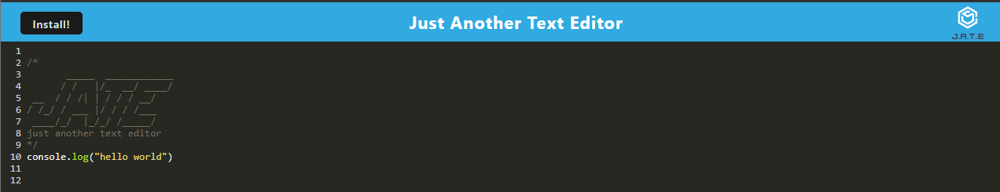
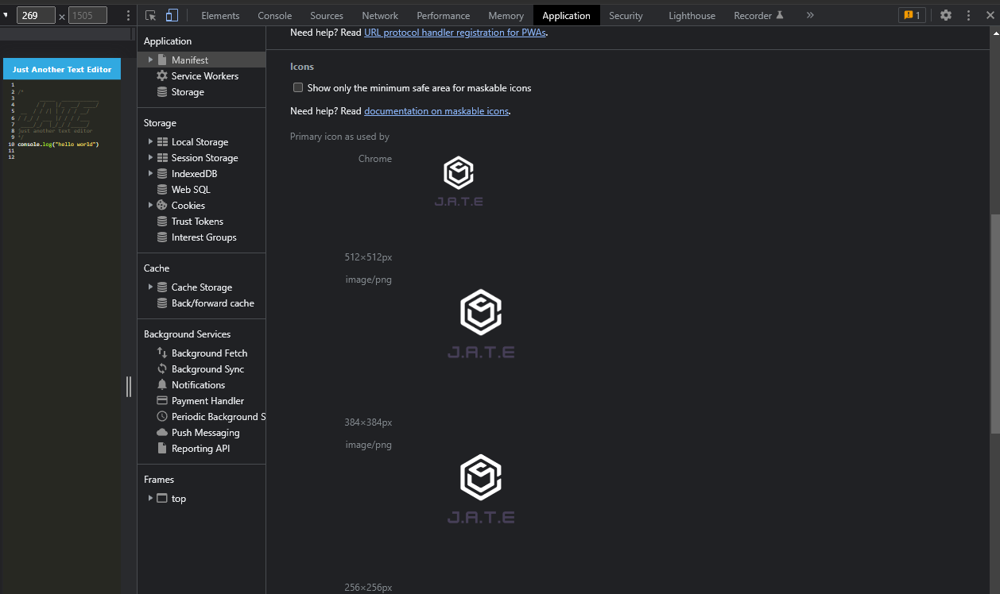
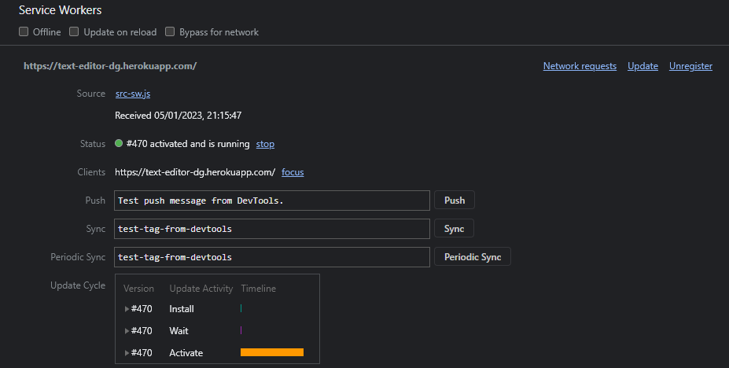
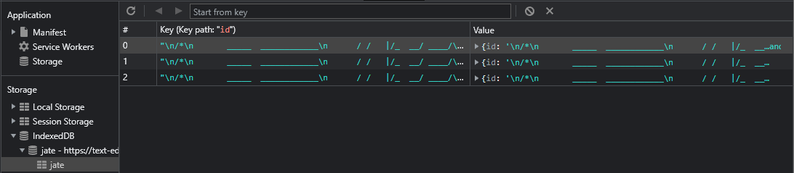

# Text-Editor

## License

https://opensource.org/licenses/MIT

## Table of Contents
* [Description](#description) 
* [Contribution Guide](#contribute)
* [Tests](#tests)
* [Questions](#questions)

## Description
This app is an online text editor that allows programmers to write code snippets in the browser and store them for later. The app is a PWA and allows users to download the program and run it locally on their machine offline. This is done using webpack.

The user is immediately shown the text editor on arrival at the website, which will automatically save the written contents. 

The download button on the top left allows the user to use a copy of the app locally using chromes tools.

The data is stored using IndexedDb which stores objects in the browser.

The app is deployed on Heroku and accessible via https://text-editor-dg.herokuapp.com/

The following images illustrate the service workers and manifest.json file as wekk as the indexedDB function

## Contribute
This app has been finished and does not require any further development.

## Tests
This app does not have any tests.

## Questions
For any questions about the code please see my github for source code, email me at the address provided. 
* https://github.com/dgourley84
* dallas.gourley@yahoo.com
* https://github.com/dgourley84/TextEditor
